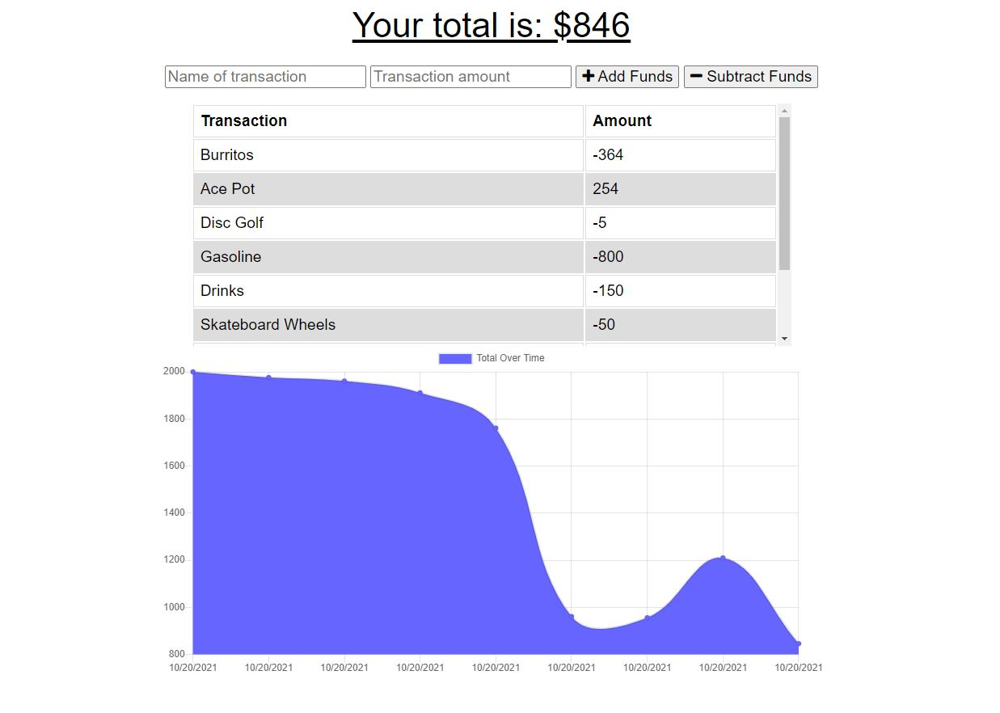

# <ins>Workout Tracker</ins>


## Description

The [Budget Tracker App](https://frozen-chamber-84417.herokuapp.com/) allows you to track your income and expenses with a simple UI and a easy to understand chart. The app also functions offline and will load any offline transactions into the backend MongoDb when it comes back online. 

## <ins>Table of Contents</ins>
- [Installation](#installation)
- [Usage](#usage)
- [Questions](#questions)

## <ins>Installation</ins>

In order to run this site locally, you will need to have MongoDB installed and running. 

Be sure to run the following command in a terminal that's opened in the same directory as server.js:
 ```md
 npm install
 ```
Finally, you can run the following code to run the backend and see it in action in an app like insomnia

 ```md
node server.js
 ```


## <ins>Usage</ins>

Below is a screen shot showing how it looks




Here is a [DEMO OF THE SITE](https://frozen-chamber-84417.herokuapp.com/) that is hosted by heroku. 


## <ins>Questions</ins>
Contact the creator of this site at lukeajcole@gmail.com. Github link: https://github.com/lukeajcole


